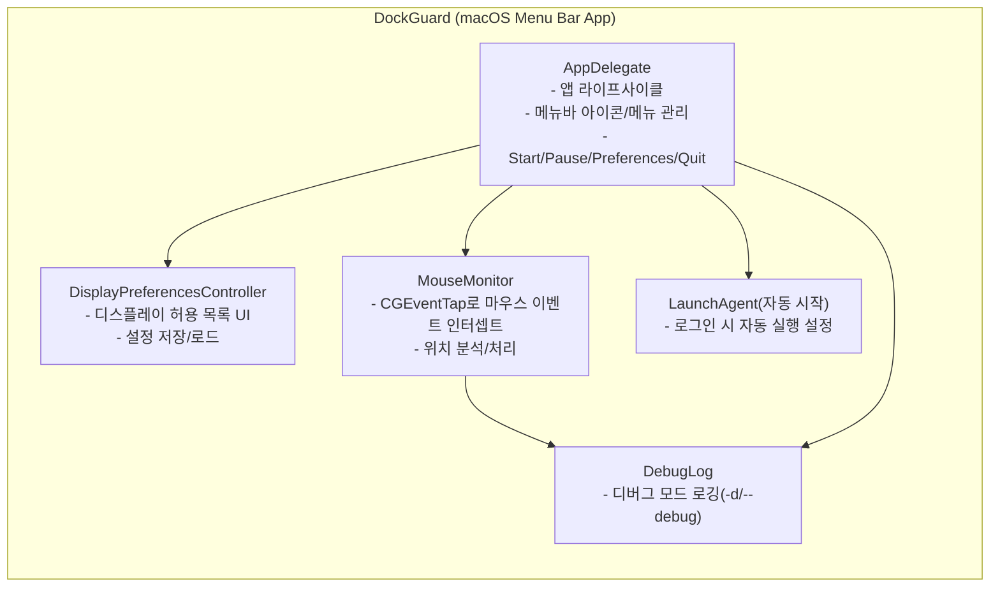
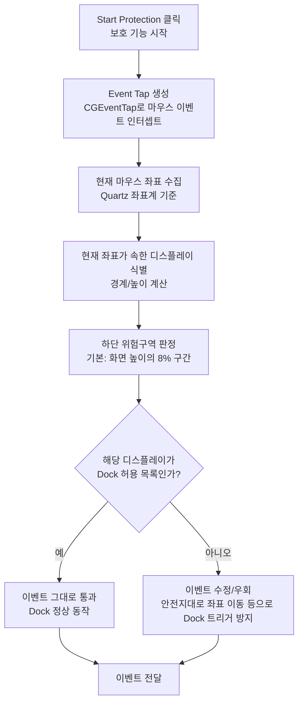
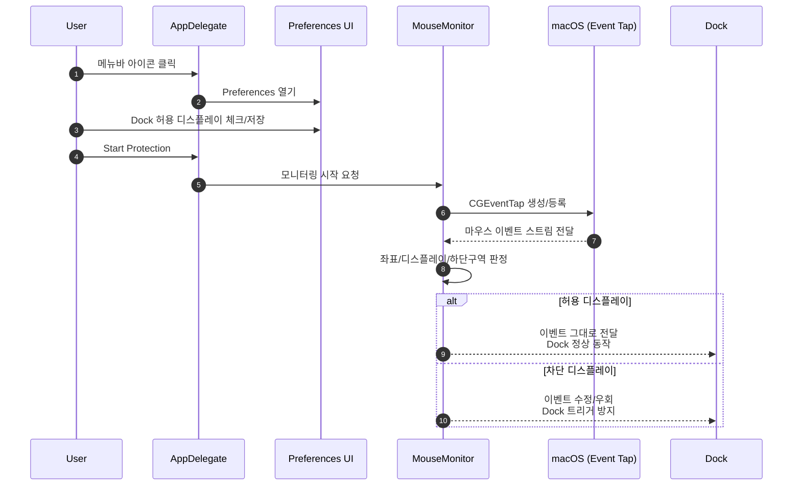

#  DockGuard

**DockGuard** is a macOS utility that intelligently prevents Dock triggers on specific displays. It protects your workflow by preventing unwanted Dock appearances in multi-display environments.

## 🎯 Key Features

- **Selective Dock Prevention**: Block Dock triggers only on specific displays while allowing normal operation on permitted displays
- **Intelligent Detection**: Real-time mouse position monitoring in the bottom 5% area of displays
- **Safe Bypass Method**: Secure prevention through event interception without modifying Dock settings
- **Background Operation**: Runs quietly in the system tray with minimal resource usage
- **Auto Start**: Provides automatic startup option at login
- **Debug Mode**: Detailed log output through command-line options

## 전체 컴포넌트 구조(모듈 관계)


## 동작 흐름(마우스가 화면 하단으로 내려갈 때)


## 사용자 조작 시퀀스(Preferences 설정 → Start → 보호 동작)


## 📋 System Requirements

- **macOS**: 10.13 (High Sierra) or later
- **Permissions**: Accessibility permissions required
- **Architecture**: Compatible with Intel x64 and Apple Silicon

## 🚀 Installation and Execution

### 1. Build

```bash
./build.sh
```

### 2. Using Patch Script (Recommended)

DockGuard provides a `patch.sh` script that automates building, updating, and deployment:

```bash
# Basic usage
chmod +x patch.sh
./patch.sh                    # Basic patch (build + restart)
```

#### Patch Script Options

```bash
# Basic commands
./patch.sh                    # Basic patch (build only)
./patch.sh --help             # Show help

# Build options
./patch.sh --clean            # Clean build
./patch.sh --sign             # Include code signing
./patch.sh --full             # Full patch (clean + build + signing)

# Deployment options
./patch.sh --backup           # Backup existing app before patch
./patch.sh --install          # Install to Applications folder after patch
./patch.sh --restart          # Kill existing process and restart

# Development options
./patch.sh --debug            # Run in debug mode
./patch.sh --test             # Run simple tests after build
```

#### Combination Usage Examples

```bash
# Complete deployment
./patch.sh --clean --sign --install --restart

# Quick test during development
./patch.sh --clean --debug

# Full update with backup
./patch.sh --backup --full --install --restart
```

### 3. Manual Execution

#### Normal execution (quiet mode)
```bash
open DockGuard.app
```

#### Debug mode execution
```bash
DockGuard.app/Contents/MacOS/DockGuard --debug
# or
DockGuard.app/Contents/MacOS/DockGuard -d
```

### 4. Setting Accessibility Permissions

When the app shows a notification that accessibility permissions are needed:

1. Go to **System Preferences** > **Privacy & Security** > **Accessibility**
2. Enable the **DockGuard** app
3. Restart the app

## ⚙️ Configuration and Usage

### Display Settings

1. Click the  icon in the menu bar
2. Select **Preferences**
3. Check the displays where Dock should be allowed
4. Click **Start** button to begin monitoring

### Auto Start Configuration

- Select the **"Launch at Login"** checkbox in the preferences window
- Automatically installs LaunchAgent for automatic startup at system boot

### Menu Bar Controls

- **Start Protection**: Start Dock prevention feature
- **Pause Protection**: Temporarily pause Dock prevention feature
- **Preferences**: Open display settings window
- **Quit**: Exit the app

## 🔧 Technical Details

### Architecture

```
DockGuard/
├── AppDelegate         # App lifecycle and menu bar management
├── MouseMonitor        # Mouse event monitoring and processing
├── DisplayPreferences  # Display settings UI and management
└── DebugLog           # Conditional logging system
```

### How It Works

1. **Event Tap Creation**: Intercept mouse events using `CGEventTap`
2. **Position Analysis**: Real-time comparison of mouse position with display boundaries
3. **Coordinate Calculation**: Accurate bottom area detection using Quartz coordinate system
4. **Event Modification**: Move mouse position to safe zone when danger zone is detected
5. **Selective Blocking**: Ensure normal Dock operation on permitted displays

### Detection Algorithm

- **Threshold**: 8% of each display height (default)
- **Detection Zone**: Entire area from threshold point to screen bottom
- **Relative Reference**: Use percentage relative to display size, not absolute values
- **Real-time Processing**: Immediate analysis on every mouse movement event

## 🐛 Troubleshooting

### When Dock Prevention Doesn't Work

1. **Check Accessibility Permissions**
   ```bash
   # Run in debug mode to check permission status
   DockGuard.app/Contents/MacOS/DockGuard --debug
   ```

2. **Verify Display Settings**
   - Check if the display is unchecked in settings
   - Verify display ID is correctly detected through logs

3. **Coordinate System Issues**
   ```bash
   # Run display debug tool
   ./display_debug.sh
   ```

### How to Check Logs

1. Launch **Console app** (Console.app)
2. Enter `DockGuard` in the search filter
3. Monitor real-time log messages

### Performance Issues

- Use **Pause Protection** to temporarily pause when Dock prevention is unnecessary
- Debug mode has performance impact due to log output

## 📁 Project Structure

```
DockGuard/
├── README.md                    # Project documentation
├── .gitignore                   # Git ignore file list
├── build.sh                     # Build script
├── Info.plist                   # App information
├── main.m                       # Main entry point
├── DebugLog.h                   # Debug logging header
├── AppDelegate.{h,m}            # App delegate
├── MouseMonitor.{h,m}           # Mouse monitoring
├── DisplayPreferencesController.{h,m}  # Settings UI
├── display_debug.sh             # Display debug tool
├── test_debug_logging.sh        # Debug test script
├── patch.sh                     # Patch script
└── DockGuard.app/              # Built app bundle
```

## 🔒 Privacy

- **Local Processing**: All data is processed locally with no external transmission
- **Minimal Permissions**: Only requires accessibility permissions, no other system permissions needed
- **Transparency**: All code is open source and publicly available

## 📝 License

© 2025 DockGuard. All rights reserved.

## 🤝 Contributing

Bug reports, feature suggestions, and code contributions are welcome.

## 📞 Support

If you encounter issues or need help:

1. First check the troubleshooting section in this README
2. Run in debug mode to check logs
3. Report issues on GitHub Issues

---

Enjoy a better multi-display experience with **DockGuard**! 🎉
